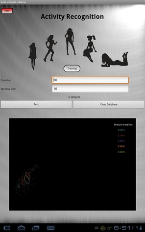

OnlineActivityRecognition
=========================

### Description
Android application toolkit for recognizing physical activities based on accelerometer data.

### Goal

We created this toolkit for studying how discriminatory is the classification between physical activities such running, walking, climbing, jumping ...
The Application visualizes the bivariate normal distributions being trained for a physical activity. The distributions corresponds to a bidimensional feature vector that corresponds to the variance and the mean of the root-sum-squared value of the three axis accelerometer sensor. The toolkit is also created
as a way to test the effect of training a physical activity performed by one person and then train the same physical activity with another person. 

### How to use

* **Run project in Android Tablet** Use Eclipse to import and compile the project inside the tablet.
* **Train** Press one of the five female figures to start training your physical activity. Press the same botton when training is finished.
* **Train/Test** Press another female figure to start training another physical activitity or to start testing the same physical activity. Press the same button when training or testing is finished.
* **Evaluate** Read the Bhattacharyya distance between the distributions to see how far are the distributions in space. 

